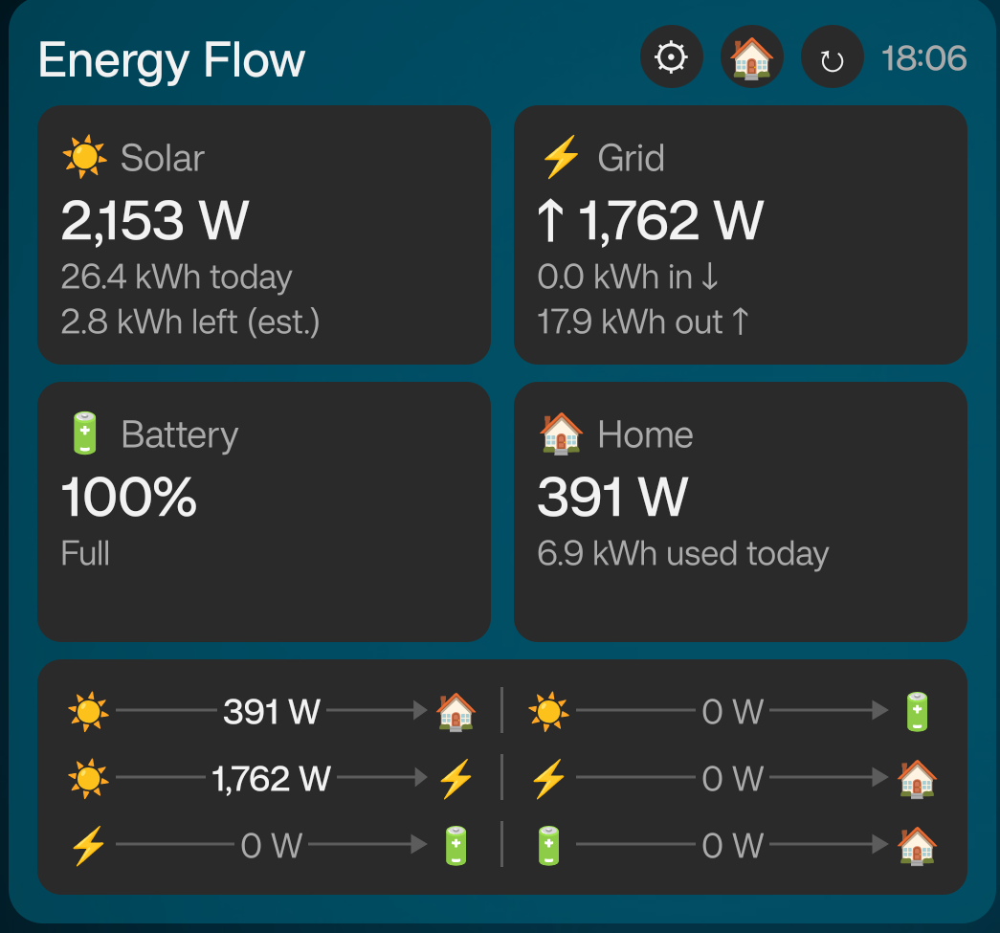

# HA Energy Flow Widget

An Android home-screen widget that shows a live solar / battery / grid / home energy-flow
dashboard, powered by data from your [Home Assistant](https://www.home-assistant.io/) instance —
no separate app required, no HA companion app dependency, just a native widget on your home
screen.



Built with Kotlin, [Jetpack Glance](https://developer.android.com/jetpack/androidx/releases/glance)
and WorkManager. Every entity is remappable, every card can be hidden, and the whole thing is
themeable — so it isn't tied to any one specific solar/battery/inverter brand.

## Features

- **Solar, Grid, Battery, Home, and Power-flow cards** — each independently shown/hidden, so the
  widget also works if you only have solar (no battery), or grid-only monitoring, etc. At least
  one card always stays visible.
- **Fully remappable entities** — every value shown comes from a Home Assistant entity you pick
  yourself in the config screen; nothing is hardcoded to a specific inverter brand.
- **Multiple widget instances, each with its own Home Assistant connection** — point different
  widgets at different HA instances if you need to.
- **Appearance customization** — widget background, card background (with opacity), primary text
  color, corner roundness, font size, 12h/24h time format, and whether to show the header, title,
  and buttons at all.
- **Battery runtime estimate** — optional "time to full" / "time to reserve" estimate, computed
  from your battery's state of charge, instantaneous power, and a configurable usable capacity
  (manual value or another HA sensor).
- **Automatic refresh** — every 15 minutes in the background (via WorkManager), plus an immediate
  refresh right after you configure or manually tap refresh.
- **Material You theming** on the config screen (Android 12+), matching your system accent color.

## Requirements

- Android 8.0 (API 26) or newer.
- A running Home Assistant instance reachable from your phone (locally or remotely — anything
  reachable by URL from your phone works, e.g. Nabu Casa, your own reverse proxy, or the same
  Wi-Fi network).
- A Home Assistant [long-lived access token](https://www.home-assistant.io/docs/authentication/#your-account-profile)
  (Profile → Security → Long-lived access tokens → Create Token).
- Sensor entities in Home Assistant for whichever cards you want to show (see
  [Sensor mapping](#sensor-mapping) below) — from any integration, any inverter/DSMR/utility
  meter brand.

## Download & Installation

1. Download the latest APK from the [Releases page](../../releases).
2. On your phone, open the downloaded APK. If this is the first time you're installing an app
   from outside the Play Store, Android will prompt you to allow installs from that source
   (browser/file manager) — allow it, then continue the install.
3. Open the app once from your app drawer to run initial setup (or skip straight to step 4 — the
   widget's own config screen does the same thing).
4. Long-press on your home screen → **Widgets** → find **HA Energy Flow** → drag it onto your
   home screen.
5. The config screen opens automatically. Enter your Home Assistant base URL (e.g.
   `https://ha.example.com`) and your long-lived access token, tap **Test connection**, then map
   each sensor field to the matching entity in your Home Assistant instance (see below).
6. Tap **Save & add widget**.

To add more widget instances (e.g. on multiple home screens, or pointed at a different HA
instance), just repeat steps 4–6 — each widget instance keeps its own connection and settings.

### Reconfiguring later

- Tap the gear icon in the widget's header, **or**
- Long-press the widget on your home screen → **Edit widget** / **Configure** (wording depends on
  your launcher) — this works even if you've hidden the header, since it's handled by Android
  itself, not the widget's own UI.

## Sensor mapping

Every field below is remapped to one of your own Home Assistant entities in the config screen's
**Sensors** tab. Only entities marked *required* need a value for that card to show something
meaningful — everything else is optional and simply omitted from the widget if left unmapped.

| Card | Field | Required | Expected unit | Notes |
|---|---|:---:|:---:|---|
| Solar | Solar (instantaneous power) | ✅ | W | Total PV/inverter input power |
| Solar | Solar Today | | kWh | Energy produced so far today |
| Solar | Solar Forecast Left | | kWh | Estimated remaining solar for today (e.g. Forecast.Solar, Solcast) |
| Battery | Battery Power | ✅ | W | Positive = charging, negative = discharging (sign matters) |
| Battery | Battery | ✅ | % | State of charge, 0–100 |
| Home | Home Load | ✅ | W | Instantaneous home consumption |
| Home | Home Today | | kWh | Energy consumed by the home so far today |
| Grid | Grid Import | ✅ | W | Power currently being bought from the grid |
| Grid | Grid Export | ✅ | W | Power currently being sold to the grid |
| Grid | Bought Today | | kWh | Energy bought from the grid so far today |
| Grid | Sold Today | | kWh | Energy sold to the grid so far today |
| Power flow | Solar → Home, Solar → Battery, Solar → Grid, Grid → Home, Grid → Battery, Battery → Home | ✅ (for that card) | W | Six non-negative directional flows, used to draw the flow-arrow rows |

Tap the ⓘ icon next to any field in the config screen for a full description of what it expects.

### Battery runtime estimate (optional)

The battery card can additionally show a "time to full" / "time to reserve (5%)" estimate. Home
Assistant has no generic "battery capacity" sensor, so you provide it yourself, in the config
screen's **Battery capacity** section:

- **Manual value** — type your battery bank's usable capacity in kWh directly, or
- **From sensor** — point it at an HA entity that reports the same thing.

Leave this unset and the card just won't show a runtime estimate.

## Appearance settings

All under the config screen's **Appearance** tab:

- **Header** — show/hide the whole top row (title, buttons, time), show/hide the title text
  specifically, and edit the title text.
- **Widget buttons** — show/hide the "open Home Assistant" button and the "widget settings"
  (gear) button.
- **Widget cards** — independently show/hide the Solar, Grid, Battery, Home, and Power-flow
  cards. The remaining visible cards automatically reflow into a 1/2/3/4-column layout.
- **Time format** — 12-hour or 24-hour.
- **Font size** — Small / Normal / Large.
- **Colors** — optional custom widget background, card background (with an opacity slider), and
  primary text color, each via a full hue/saturation/value color picker. Non-configurable text
  and the flow arrows automatically adjust for contrast against whatever background you pick.
- **Shape** — corner roundness slider.

A **Reset appearance to defaults** button at the bottom resets everything on this tab (not your
sensor mapping or HA connection) back to the original look.

> **Heads up:** turning off "Show header" also hides the in-widget settings (gear) button — the
> config screen warns you about this and asks for confirmation. You can still get back in via
> long-press → Edit/Configure on the home screen (see [Reconfiguring later](#reconfiguring-later)).

## Building from source

```bash
git clone https://github.com/<your-username>/ha-energy-flow-widget.git
cd ha-energy-flow-widget
./gradlew :app:assembleDebug
```

The debug APK is written to `app/build/outputs/apk/debug/app-debug.apk`. Open the project in
Android Studio (Koala or newer) if you'd rather build/run/debug from there.

Pushing a `v*` tag (e.g. `v1.0.0`) triggers a GitHub Actions workflow that builds the APK and
attaches it to a new [Release](../../releases) automatically.

## Privacy & permissions

The widget only talks directly to the Home Assistant URL you configure — no third-party servers,
no analytics, no ads. Your HA URL and access token are stored on-device using
[EncryptedSharedPreferences](https://developer.android.com/reference/androidx/security/crypto/EncryptedSharedPreferences).

## Contributing

Issues and pull requests are welcome — this widget is meant to work for setups beyond the
author's own (solar + battery + DSMR grid meter), so reports of missing sensor kinds, integration
quirks, or layout issues on different screen sizes are all useful.

## License

[MIT](LICENSE)
